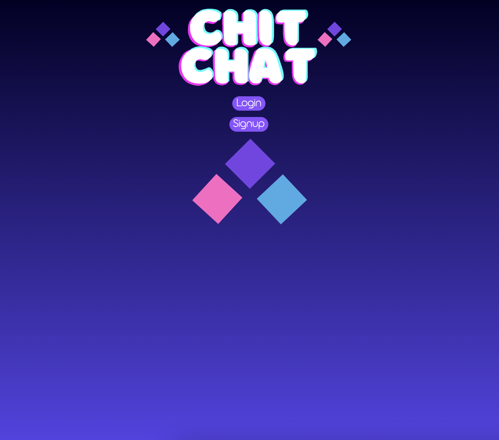
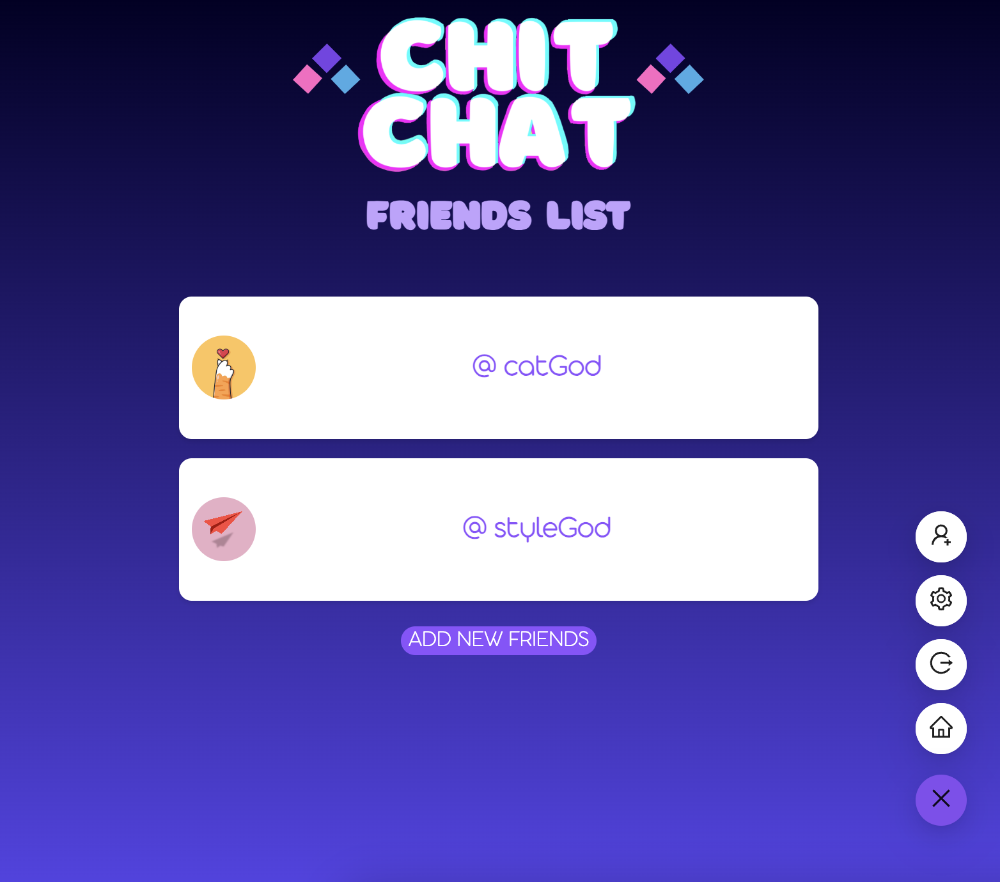
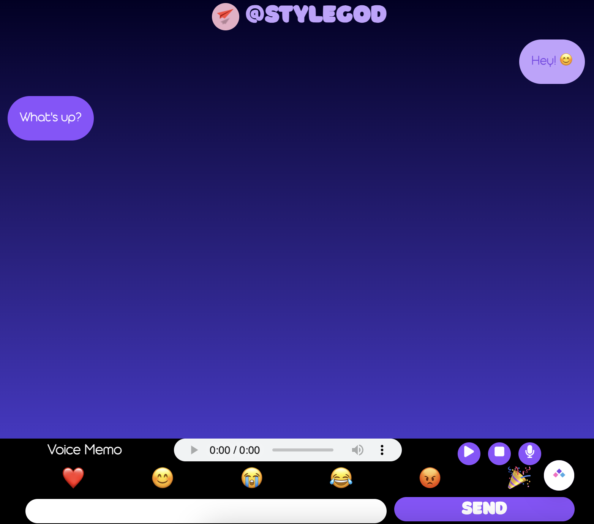
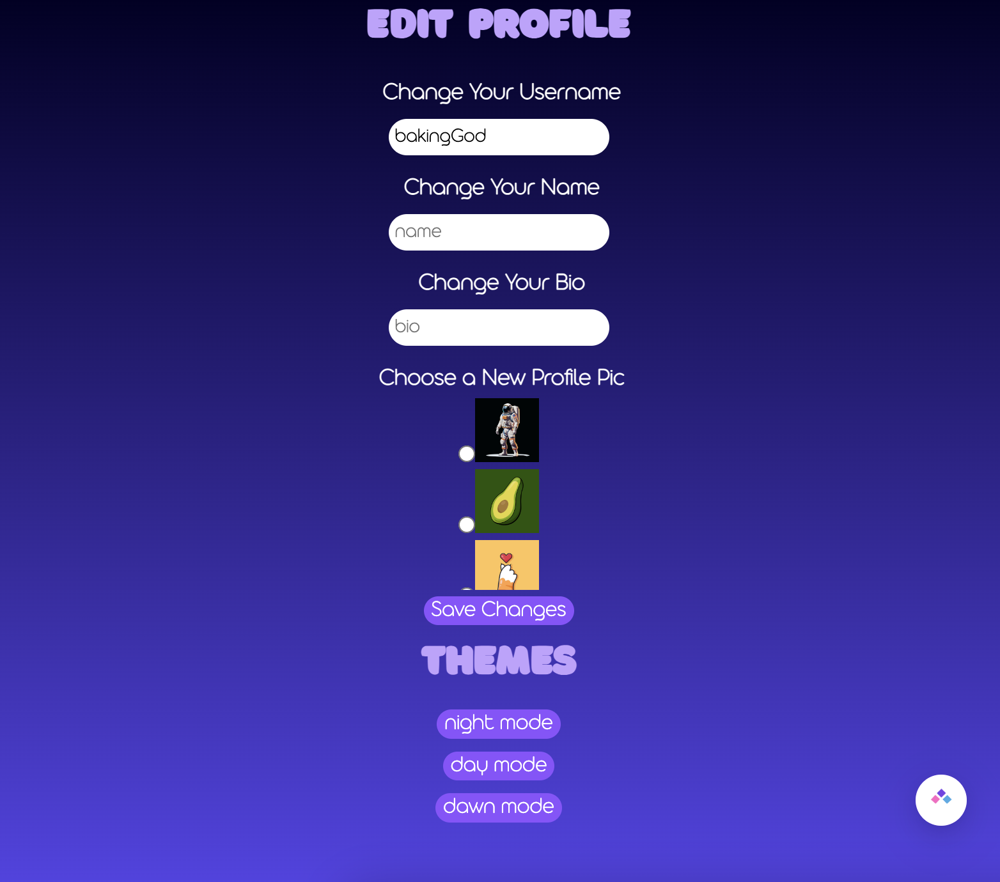

# Chit Chat

## UCLA Bootcamp Project 3

## User Story
AS A User\
I WANT TO instant message friends and show off my profile\
SO THAT I can keep in touch with friends on my friends list

## Acceptance Criteria
GIVEN a instant messaging app/website\
WHEN I load the site\
THEN I am presented with the option to login or signup\
WHEN I click the login option\
THEN I am presented with a form to input my username and password\
WHEN I click the signup option\
THEN I am presented with a form to input  my name, username, and password\
WHEN I am logged in\
THEN I am present with my dashboard that displays friends, chat previews, and an option to add friends\
WHEN I choose to edit my profile\
THEN I am presented with my profile, and an option to change my photo, bio, and interests\
WHEN I click on a friend from the list\
THEN I am presented with their profile, which includes their name, username, photo, bio, interests, and an option to start a chat with them\
WHEN I click on the option to start a chat with a friend\
THEN I am presented with a page displaying our the friend’s name/username at the top, chat history, and a send messages box at the bottom\
WHEN I view the chat history\
THEN I see my messages on one side, and my friend’s messages on the other side\

## Installation

To install, run <code>npm i</code>.\
To seed, run <code>npm run seed</code>.\
To start, run <code>npm run develop</code>.

## Usage

This project has been deployed at:

## Credits

This project was created by Ramita Indurkhya, Justin Chun, William Gomez, Jamie Han and Eric Lee.

© 2023 ChitChat-Team WeChatAlot Confidential and Proprietary. All Rights Reserved.
